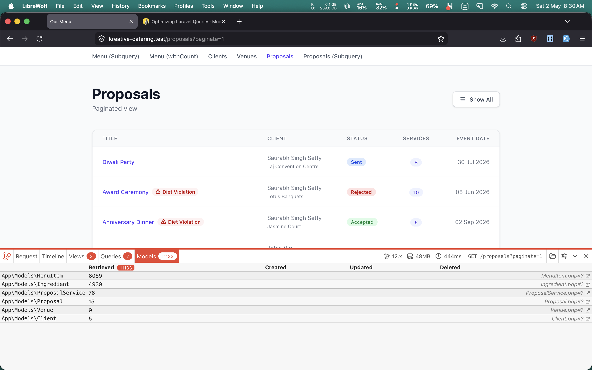
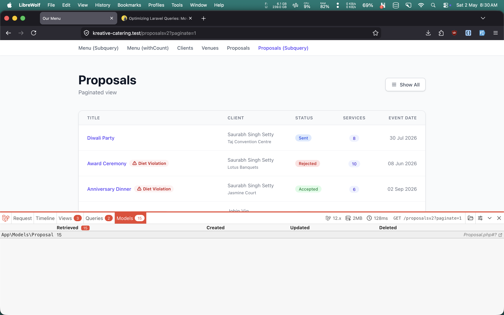

# Part 2 : Proposal Diet Violations

In [part 1](https://v4vinayakdev.pages.dev/blog/laravel-example-query), I showed how moving vegetarian checks from Laravel collections into PostgreSQL reduced memory usage and removed unnecessary model hydration. This follow-up applies the same idea to a more realistic screen: a proposal dashboard where each proposal contains multiple services, and each service contains multiple menu items.

The requirement sounds simple:

- show a `Pure Veg` badge when a proposal only contains vegetarian services
- show a `Diet Violation` badge when a vegetarian service contains a non-vegetarian menu item

The catch is that this information is not stored directly on the `proposals` table. It has to be derived through multiple relationships.

## Routes

```php
Route::get('/proposals', [ProposalController::class, 'index'])->name('proposals.index');
Route::get('/proposalsv2', [ProposalController::class, 'indexV2'])->name('proposals.index-v2');
Route::get('/proposals/{proposal}', [ProposalController::class, 'show'])->name('proposals.show');
```

The `proposals.index` is the application-side version.  
The `proposals.index-v2` is the database-driven version.  
The `proposals.show` is the detail screen that shows exactly which service is violating the vegetarian rule.

## Data Shape

```text
Proposal
├── client()
├── venue()
└── proposalServices()
    ├── is_vegetarian
    ├── servicePeriod()
    └── menuItems()
        └── ingredients()
            └── vegetarian
```

This is where the cost starts to grow. To answer one badge-level question on the proposal row, the application may end up loading:

- proposals
- proposal services
- menu items
- ingredients

That is a lot of hydrated PHP objects just to answer: "Does this proposal have any vegetarian service with a non-vegetarian ingredient?"

## Version 1: Calculate in Laravel

The `/proposals` route uses eager loading and computes violations in PHP:

```php
public function index(Request $request): View
{
    $paginate = $request->boolean('paginate');

    $proposals = Proposal::with([
        'client',
        'venue',
        'proposalServices.menuItems.ingredients',
    ])->withCount([
        'proposalServices',
        'proposalServices as non_vegetarian_services_count' => static fn ($q) => $q->where('is_vegetarian', false),
    ])->latest();

    $proposals = $paginate ? $proposals->paginate(15) : $proposals->get();

    $proposalCollection = $paginate ? $proposals->getCollection() : $proposals;

    $proposalCollection->each(static function (Proposal $proposal): void {
        $proposal->setAttribute('diet_violation_count', $proposal->calculateDietViolationCount());
    });

    return view('proposals.index', compact('proposals', 'paginate'));
}
```

And the actual calculation happens on the model:

```php
public function calculateDietViolationCount(): int
{
    return $this->proposalServices
        ->filter(function (ProposalService $proposalService): bool {
            if (! $proposalService->is_vegetarian) {
                return false;
            }

            return $proposalService->menuItems->contains(function (MenuItem $menuItem): bool {
                return $menuItem->ingredients->contains(function (Ingredient $ingredient): bool {
                    return ! $ingredient->vegetarian;
                });
            });
        })
        ->count();
}
```

This works, and it is easy to read. But it has a clear performance cost:

- Laravel has to hydrate the full nested graph
- every proposal row is processed in PHP
- every service loops through menu items
- every menu item loops through ingredients

In other words, the code is doing set-based work one object at a time.

## Why This Gets Expensive

Assume a page loads:

- 30 proposals
- 4 services per proposal
- 8 menu items per service
- 6 ingredients per menu item

That is already:

- 30 proposal models
- 120 proposal service models
- 960 menu item relations
- 5,760 ingredient relations

And all of that is loaded into PHP memory just to decide whether to show one red badge!

## Version 2: Offload the Work to PostgreSQL

The `/proposalsv2` route pushes the diet violation calculation into SQL:

```php
public function indexV2(Request $request): View
{
    $paginate = $request->boolean('paginate');

    $proposals = Proposal::withClientAndVenueDetails()
        ->withDietViolations()
        ->withCount([
            'proposalServices',
            'proposalServices as non_vegetarian_services_count' => static fn ($q) => $q->where('is_vegetarian', false),
        ])
        ->latest();

    $proposals = $paginate ? $proposals->paginate(15) : $proposals->get();

    return view('proposals.indexv2', compact('proposals', 'paginate'));
}
```

The important part is the scope:

```php
public function scopeWithDietViolations($query)
{
    return $query->addSelect([
        DB::raw('(
            SELECT
                COUNT(DISTINCT service_period_id)
            FROM
                proposal_services ps
                JOIN menu_item_proposal_service mips ON mips.proposal_service_id = ps.id
                JOIN ingredient_menu_item imi ON mips.menu_item_id = imi.menu_item_id
                JOIN ingredients i ON i.id = imi.ingredient_id
            WHERE
                ps.proposal_id = proposals.id
                AND ps.is_vegetarian = TRUE
                AND i.vegetarian = FALSE
        ) as diet_violation_count'),
    ]);
}
```

Now the question is answered by the database before the row even reaches Laravel.

Instead of saying:

"Load everything, then inspect each relationship in PHP."

we say:

"Database, tell me how many violating vegetarian services this proposal has."

That is exactly the kind of work relational databases are good at.

## What Changed in the View

Almost nothing.

Both proposal list views render the same badge:

```blade
@if ($proposal->diet_violation_count)
    <span class="inline-flex items-center gap-1 rounded-full bg-red-50 px-2 py-0.5 text-xs font-semibold text-red-700">
        Diet Violation
    </span>
@endif
```

That is the main benefit of pushing derived values into the query layer: the Blade template stays simple.

## Before / After





## What Performance Improvement Did We Get?

The exact answer depends on your dataset, because the benefit scales with relationship fan-out:

- how many proposals are on the page
- how many services each proposal has
- how many menu items each service has
- how many ingredients each menu item has

In part 1, the simpler menu example already saved roughly `10MB` of memory. This proposal example has a much deeper relationship graph, so the gain can be even more noticeable on larger datasets.

The safest way to present the result in the blog is:

```text
The database-driven version removes the need to hydrate proposalServices, menuItems, and ingredients just to compute a badge. On large proposal lists, that reduces PHP memory pressure and shifts the heavy filtering work to PostgreSQL, where set-based operations are much faster.
```

### Lets measure performance improvements

- response time
- peak memory
- query count
- Model count

For example:

```text
Before  (/proposals):  500ms | 50 mb | 7 query, 11k models !
After   (/proposalsv2): 128ms | 2mb | 2 query, 15 models (Proposal)
```

Here `proposalsv2` we are loading only the Porposal model, and the db takes care of loading the ingredients which is much more performance improvemetns.

## Why `/proposals/{proposal}` Still Matters

The list page only tells us that a proposal has a problem. It does not tell us which service is causing it.

That is why the detail route exists:

```php
Route::get('/proposals/{proposal}', [ProposalController::class, 'show'])->name('proposals.show');
```

Its job is different from the list page. Instead of calculating a proposal-level count, it calculates a service-level boolean:

```php
public function show($proposal): View
{
    $proposal = Proposal::withClientAndVenueDetails()
        ->with([
            'proposalServices.servicePeriod',
            'proposalServices' => static fn ($q) => $q->withDietViolation()->withCount('menuItems'),
        ])
        ->find($proposal);

    return view('proposals.show', compact('proposal'));
}
```

The `withDietViolation()` scope on `ProposalService` adds a `has_diet_violation` field:

```php
public function scopeWithDietViolation(Builder $query): void
{
    $query
        ->leftJoinSub(
            DB::table('proposal_services as ps_sub')
                ->select(
                    'ps_sub.id as proposal_service_id',
                    DB::raw('
        (
            ps_sub.is_vegetarian
            AND EXISTS (
                SELECT 1
                FROM menu_item_proposal_service
                JOIN ingredient_menu_item ON menu_item_proposal_service.menu_item_id = ingredient_menu_item.menu_item_id
                JOIN ingredients ON ingredients.id = ingredient_menu_item.ingredient_id
                WHERE menu_item_proposal_service.proposal_service_id = ps_sub.id
                AND ingredients.vegetarian = FALSE
            )
        ) AS has_diet_violation
        ')
                ),
            'diet_check',
            'diet_check.proposal_service_id',
            '=',
            'proposal_services.id'
        )
        ->select('proposal_services.*', 'diet_check.has_diet_violation');
}
```

This route is useful because it answers a different question:

- `/proposalsv2` asks: "Does this proposal have any bad vegetarian service?"
- `/proposals/{proposal}` asks: "Which exact service inside this proposal is violating the rule?"

That boolean is then rendered directly in the service card:

```blade
@if ($service->has_diet_violation)
    This service is marked as Pure Veg but contains non-vegetarian items.
@endif
```

So the overall pattern becomes:

- proposal list: compute a proposal-level summary in SQL
- proposal detail: compute a service-level flag in SQL
- Blade: render only the result

## Final Takeaway

The unoptimized route is not wrong. It is simply doing relational work in the wrong layer.

When Laravel loads `proposalServices -> menuItems -> ingredients` just to compute a badge, the application becomes responsible for work that PostgreSQL can do more efficiently with joins, aggregates, and `EXISTS`.

That is the core lesson from both parts of this refactor:

- use PHP for orchestration and presentation
- use SQL for filtering, existence checks, counts, and derived flags

Once the data grows, that separation stops being an optimization detail and starts being the difference between a page that scales cleanly and one that slowly turns into a memory-heavy loop.

Play around with the codebase [vinayakdev/kreative-catering](https://github.com/vinayakdev/kreative-catering)
